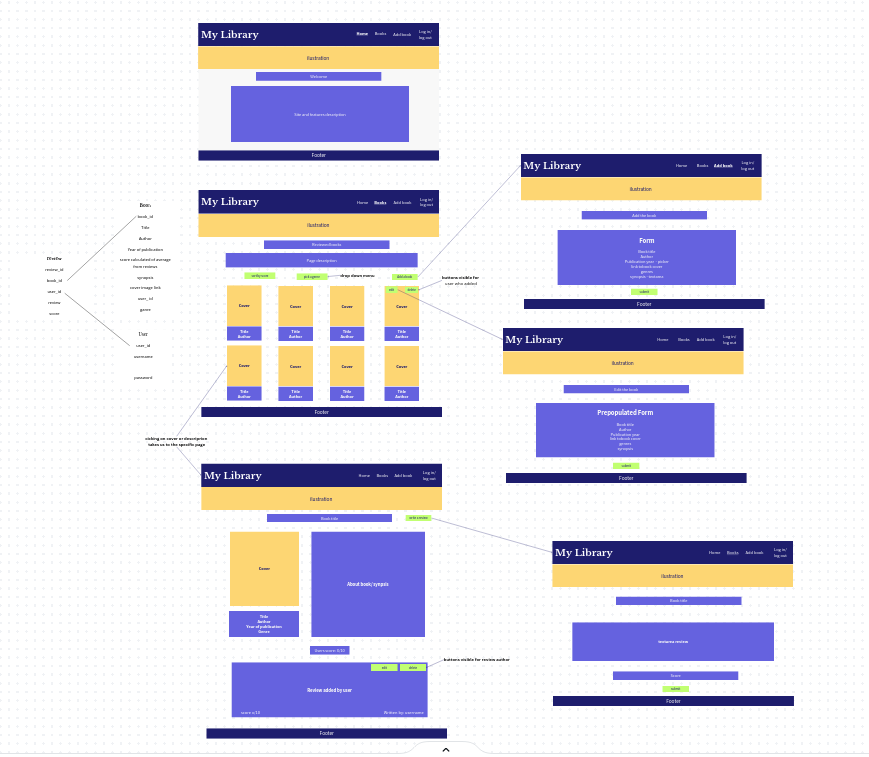
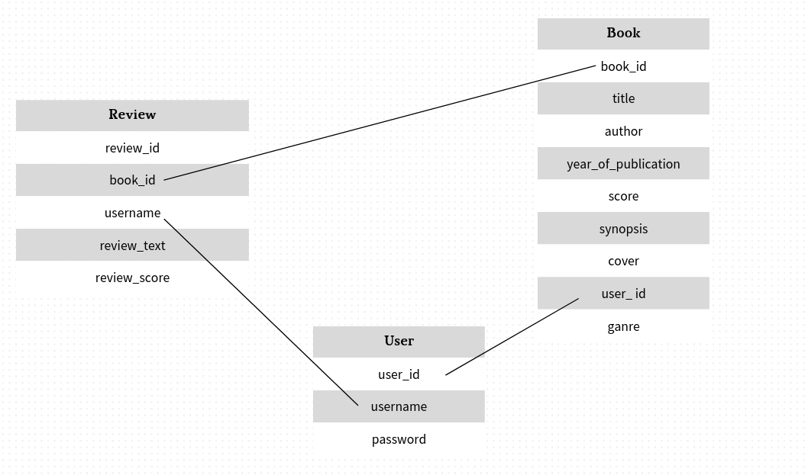
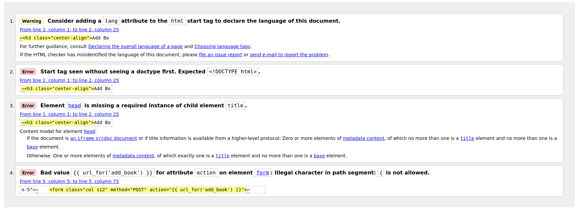
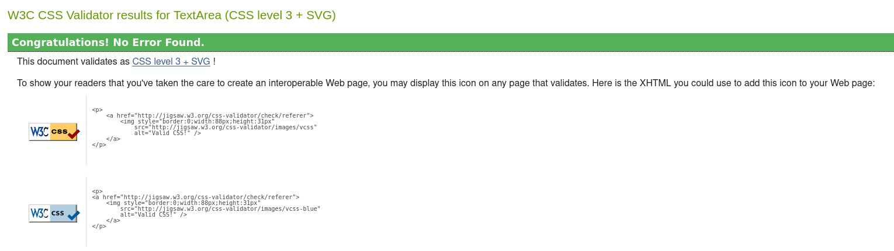
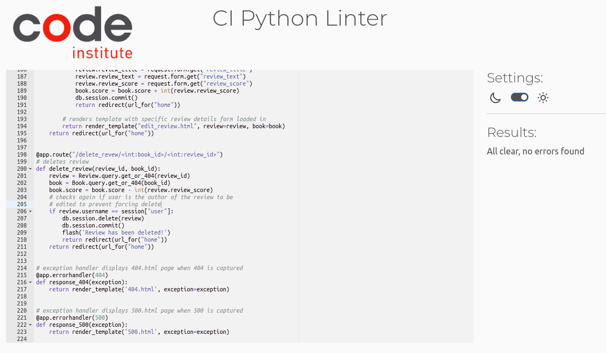

## Code Institute Milestone Project 3
# Bookspire

[See live website](https://bookspire-project.herokuapp.com/)

## Mockup

## UI/UX
### Project goals

Bookspire is a fictitious book review website.
The page works as a database and review site for books.
Users can add books and reviews.
Sorting mechanism allows users to find the most popular books.
The more books and reviews are added the more attractive the page is for potential users.
the page can be then linked to amazon webste to create profit through affiliate links. 

### User Stories

As a User I would like to:

- log in to feel as a part of book lovers community
- share my favourite books with and inspire others to read them
- review books to recommend them to other users
- read reviews and find good books to read

### Developer goals

Allow users to easily:

- register to the website
- log in to the website
- navigate through the site
- add books they want to share with others
- edit books they added in case there are some mistakes
- delete books they added
- add reviews to books and give thumbs up to the ones they would recommend
- edit and delete the reviews they added
- find books worth reading by sorting them in order starting from he ones with the most positive reviews

## Design

### Wireframes

The wireframes for desktop view were developed first then mobile view and responsiveness was being checked while working on the project.

### Colour Palette

Colour palette consists mostly of browns ang harmonises with a picture of old books showing on every page.

### Fonts

Font awesome was used to generate icons.

## Defensive design

Users need to be logged in to be able to add reviews.
Users can edit and delete only the books and reviews that they created.
Attempting to force the url to add/edit/delete book or review causes 404 error.

There is a need to add modal of some sort to protect users from accidentally deleting books or reviews.
The attempts of achieve that are described in the unsolved bugs section.

## Features

### Existing features

#### When not logged in

Navigation   
Navigation bar consists of a logo which also serves as a link to the main page.
The menu options visible for people who are not logged in consist of Homepage, Log in, Register links.

Registration   
Potential users can register their account by providing a unique username and password which is at least 5 characters long.
In case of username being already used (input field is not case sensitive) message is displayed.
If the password is too short, the user is informed about the minimum length.

Logging in   
User can log in (this input field is also not case sensitive)
In case of either username not existing or password being incorrect the user receives the same message.

Read   
The books and reviews already added are visible regardless of whether the user is logged in or not.
Clicking on the title takes us to a page dedicated to that book where we can see reviews.

Sorting    
Books initially display the newest at the top, however, they can also be sorted by number of positive reviews.

#### When logged in

Create, Update, Delete   
Users who are logged in can add books and reviews, edit and delete the content they added.

Log out   
Log out option is located in the nav bar.

### Information Architecture

Schema:

## Technologies used

- Languages:

 * HTML Used to create the structure of websites
 * CSS Used to add style to the website
 * JavaScript Used to activate dynamic elements
 * Python  Used to create and run the web application
 * Jinja  Template engine
 - Websites
 * Am I Responsive - Used to create the mock-up image showing the site
 * Coolors Used to create colour palette for the site
 * Google Chrome Developer Tools - Used to test the responsiveness of the site
 * Firefox Developer Tools - Used to test the responsiveness of the site
 * Font Awesome - Used to source icons
 * Canva - Used to create wireframes and logo
 * Pixabay - Used to source hero image
 * Wikipedia - Used to source book cover pictures and book synopsis description
 * Github - Used as a repository
 * Gitpod -An online IDE used to build and develop the website
 * Heroku- The cloud platform used to host the deployed site
 * Slack - Used during development and testing to find the solutions for the encountered problems
 * Stack Overflow - Used to search for the answers to encountered problems
 * Code Institute - Used to review concepts covered in preceding modules and walk-through projects
 * RandomKeyGen - Used to generate the Secret Key
 * W3C CSS Validation Service - Used to validate the CSS code
 * W3C HTML Validation Service - Used to validate the HTML code
 * Pep8CI - Used to check the run.py file for PEP8 compliance
 * ElephantSQL - PostgreSQL database hosting service

- Frameworks
 * Materialise Framework - Used to add various structures to the website
 * Flask - Python web framework used to create the web app

- Database
 * PostgreSQL - Used as a database to store the users' information, book reviews and other data

## Testing

W3C HTML Validation Service was used to validate HTML.

CSS was validated without any problems

Python code was validated with no problems

### Manual testing

All aspects of CRUD functionality and page features were tested.

Create

It is possible to create User, Book and Review.
To create Book and Review the user has to be logged in.

User - unique username needs to be provided. Passwords need to be at least 5 characters long.
Book - form

Read

Books and reviews load in.
Books are displayed from the newest to oldest. It is also possible to sort them by the number of positive reviews.

Update

Books and Reviews can be updated but only by the user who created them.
If someone tries to force their way through an overriding URL the page will throw an error.
Forms are pre populated with data.
When the review is updated its score is deducted (X-1 in case of positive and X-0 in case of negative) then after resubmission it is calculated again. Score stays intact if the edit was not finalised.
Some fields are restricted to certain inputs
- year of publication four digits
- cover image link needs to start with http:// or https://
- synopsis must contain at least 200 characters

Delete

Books and Reviews can be deleted but only by the user who created them
If the books get deleted all the reviews are deleted with them.
Option to delete user has not been added. This is one of the features a Bookstore would need. Scheema is set up in the way that deletion of user would cause deletion of all the book and reviews added by them.
Delete button is currently not guarded by modal as I was not able to fix the bug.

### Bugs

Modal adding extra layer of security over delete button:
The modal would not load book.id/review.id correctly. Books/reviews are displayed using the for loop and modal would take the id of the first object of the loop rather than the one that was clicked.

## Deployment

In ElephantSQL
1. Use ElephantSQL to host PostgreSQL database
2. Log in to ElephantSQL
3. Click create new instance, give it a name and pick region
4. On ElephantSQL dashboard click on the database instance reated
5. Copy URL

In IDE workspace
6. Create requirements.txt file which contains a list of the Python dependencies and a Procfile which contains the start command to run the project

On Heroku
1. Log into Heroku website
2. Created a new app by clicking the "New" button
3. Give app a name and set region (Europe)
4. In Deploy section choose GitHub
5. In Settings reveal Config Vars
6. Add a Config Var called DATABASE_URL and paste previously copied ElephantSQL database URL
7. Add variables from your env.py file except DEVELOPMENT and DB_URL and DEBUG
8. In Deploy tab make sure Github is connected
9. Deploy branch from main

Adding tables to database
1. On Heroku page right top corner click more and run console
2. Run commands:

python3 
from task manager import db   
db.create_all()

Page and database are ready to use.

## Credits

The code was written by me. I was basing it on the Code Institute walk through project for understanding of CRUD functionality and user log in.

