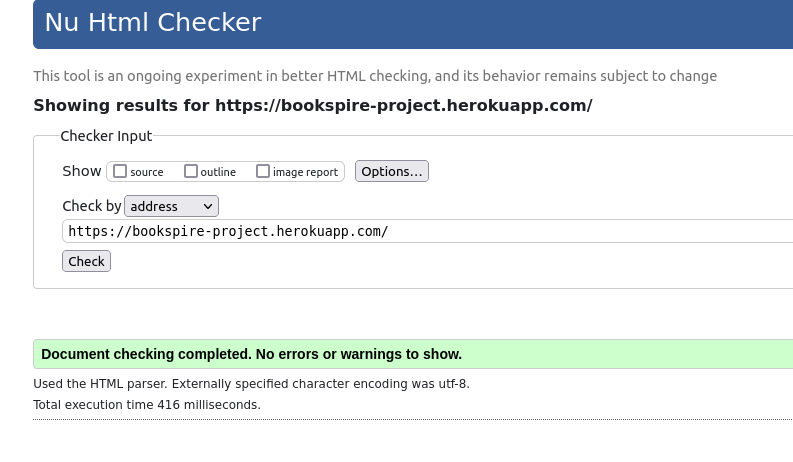

## Code Institute Milestone Project 3
# Bookspire

[See live website](https://bookspire-project.herokuapp.com/)

## Mockup

## UI/UX
### Project goals

Bookspire is a fictitious book review website.
The page works as a database and review site for books.
Users can add books and reviews.
Sorting mechanism allows users to find the most popular books.
The more books and reviews are added the more attractive the page is for potential users.
The page could potentially be then linked to amazon webste to create profit through affiliate links. 

### User Stories

As a User I would like to:

- log in to feel as a part of book lovers community
- share my favourite books with and inspire others to read them
- review books to recommend them to other users
- read reviews and find good books to read

### Page owner goals

As an owner of this page I would like to:

- build the database of books and reviews by:
- adding them myself
- have users add books and reviews
- attract more users by making the page useful to them (the more information it consists the more useful it gets)
- eventually link up amazon and gain profit through affiliate links

### Developer goals

Allow users to easily:

- register to the website
- log in to the website
- navigate through the site
- add books they want to share with others
- edit books they added in case there are some mistakes
- delete books they added
- add reviews to books and give thumbs up to the ones they would recommend
- edit and delete the reviews they added
- find books worth reading by sorting them in order starting from the ones with the most positive reviews or the ones added most recently

## Design

### Wireframes

The wireframes for desktop view were developed first then mobile view and responsiveness was being checked while working on the project.

### Colour Palette

Colour palette consists mostly of browns and harmonises with a picture of old books showing on every page.

### Fonts

Font awesome was used to generate icons.
Fonts Ms-Madi and Courgette were imported from google fonts.
Ms-Madi resembles font used in Bookspire logo and is used on the homepage by Welcome header.
Courgette font is used for homepage text, headings and book titles.

## Defensive design

Users need to be logged in to be able to add reviews and books.
Users can edit and delete only the books and reviews that they created.
Attempting to force the url to add/edit/delete book or review causes 404 error.
Please see manual tests section for more details.

There is a need to add modal of some sort to protect users from accidentally deleting books or reviews.
The attempts of achieve that are described in the unsolved bugs section.

## Features

### Existing features

#### When not logged in

Navigation   
Navigation bar consists of a logo which also serves as a link to the main page.
The menu options visible for people who are not logged in consist of Homepage, Log in, Register links.

Registration   
Potential users can register their account by providing a unique username and password which is at least 5 characters long.
In case of username being already used (input field is not case sensitive) message is displayed.
If the password is too short, the user is informed about the minimum length.

Logging in   
User can log in (this input field is also not case sensitive)
In case of either username not existing or password being incorrect the user receives the same message.

Read   
The books and reviews already added are visible regardless of whether the user is logged in or not.
Clicking on the title takes us to a page dedicated to that book where we can see reviews.

Sorting    
Books initially display the newest at the top, however, they can also be sorted by number of positive reviews or reverted to sorting newest first by clicking respective buttons on the home page.

#### When logged in

Users can Read, Sort and Navigate just like the ones who are not logged in.

Create, Update, Delete   
Users who are logged in can add books and reviews, edit and delete the content they added.

Log out   
Log out option is located in the nav bar.

### Information Architecture

Schema:

## Technologies used

- Languages:

 * HTML Used to create the structure of websites
 * CSS Used to add style to the website
 * JavaScript Used to activate dynamic elements
 * Python  Used to create and run the web application
 * Jinja  Template engine
 - Websites
 * Am I Responsive - Used to create the mock-up image showing the site
 * Coolors Used to create colour palette for the site
 * Google Chrome Developer Tools - Used to test the responsiveness of the site
 * Firefox Developer Tools - Used to test the responsiveness of the site
 * Font Awesome - Used to source icons
 * Canva - Used to create wireframes and logo
 * Pixabay - Used to source hero image
 * Wikipedia - Used to source book cover pictures and book synopsis description
 * Github - GitHub for versionn control for the development of application up to deployment
 * Gitpod -An online IDE used to build and develop the website
 * Heroku- The cloud platform used to host the deployed site
 * Slack - Used during development and testing to find the solutions for the encountered problems
 * Stack Overflow - Used to search for the answers to encountered problems
 * Code Institute - Used to review concepts covered in preceding modules and walk-through projects
 * RandomKeyGen - Used to generate the Secret Key
 * W3C CSS Validation Service - Used to validate the CSS code
 * W3C HTML Validation Service - Used to validate the HTML code
 * Pep8CI - Used to check the run.py file for PEP8 compliance
 * ElephantSQL - PostgreSQL database hosting service

- Frameworks
 * Materialise Framework - Used to add various structures to the website
 * Flask - Python web framework used to create the web app

- Database
 * PostgreSQL - Used as a database to store the users' information, book reviews and other data

## Testing

W3C HTML Validation Service was used to validate HTML all the pages were checked through URL and showed no problems

CSS was validated through W3C CSS Validation Service without any problems

Python code was validated with no problems through Pep8CI

### Manual testing

All aspects of CRUD functionality and page features were tested.

**CREATE**

It is possible to create User, Book and Review.
To create Book and Review the user has to be logged in.
Book title needs to be unique so there are no doubled entries.
Some fields are restricted to certain inputs
- year of publication - four digits - first one being 0, 1 or 2 
- cover image link needs to start with http:// or https://
- synopsis must contain at least 200 characters
- with possibility of title and author name/pseudonym being absolutely anything there is no restriction on maximum length and format, however, it needs to be at least one character long. If that prooves problematic it can be easly changed for example by adding pattern="[a-zA-Z0-9-_.]"
- review body needs to be at least 50 characters
- unique username needs to be provided for each new user 
- passwords need to be at least 5 characters long.

| Test        | Expected outcome | Result |
| ----------- | ----------- |--------- |
| **Book** |  | |
| Create a new book entry using various special characters and letteres including polish, japanese and korean and within restraints of the form: <ul><li>All fields filled in</li><li>Year of publicaton starts with 0, 1 or 2</li><li>Link to cover starts with http:// or https://</li><li>Synopsis has more than 200 characters</li></ul> | New entry for a book created and showing on the main page | Passed |
| Create a new book entry without a title field filled in | Form does not submit. Request to fill the field pops up. | Passed |
| Create a new book entry without an author field filled in | Form does not submit. Request to fill the field pops up. | Passed |
| Create a new book entry without a date Form does not submit. Request to fill the field pops up. | Passed |
| Create a new book entry with less than 4 digits | Form does not submit. Request to use at least 4 characters pops up. | Passed |
| Create a new book entry with date starting from a number larger than 2 | Form does not submit. 'Enter a four digits starting with 0, 1 or 2' messsage pops up. | Passed |
| Create a new book entry without the synopsis | Form does not submit. Request to fill the field pops up. | Passed |
| Create a new book entry with synopsis having less than 200 characters | Form does not submit. Request to use at least 200 characters pops up | Passed |
| Create a new book entry without link to cover | Form does not submit. Request to fill the field pops up. | Passed |
| Create a new book entry with invalid link to cover (not starting with http:// or https://) | Form does not submit. Request for link to start with http:// or https:// pops up  | Passed |
| **Review** |  | |
| Create a new review entry using various special characters and letteres including polish, japanese and korean and within restraints of the form: <ul><li>All fields filled in</li><li>body of review is at least 50 characters long</li></ul> | New entry for a book created and showing on the main page.| Passed |
| Create a new review entry without a headline field filled in | Form does not submit. Request to fill the field pops up. | Passed |
| Create a new review entry without a review field filled in | Form does not submit. Request to fill the field pops up. | Passed |
| Create a new review entry with review having less than 50 characters | Form does not submit. Request to use at least 50 characters pops up | Passed |
| Create a new review entry withouth selecting one of the redio boxes | Form does not submit. Request to select one of teh boxes pops up | Passed |
| **User** |  | |
| Create new user with unique username between 3-15 and password minimum 5 characters and consisting of letters and numbers  | Form submits. "Registration successful!"
"Welcome, {USERNAME}. You are now logged in!" messages shows. | Passed |
| Create new user with username already taken | Form does not submit. "This username already exists, please try another username." message shows. | Passed |
| Create new user without username | Form does not submit.  | Passed |
| Create new user with username longer than 15 characters | Impossible to imput more than 15 characters.  | Passed |
| Create new user without password | Form does not submit. "Username needs to be between 3-15 characters and consist of letters and numbers only" message can be seen when hoovering over the input field. | Passed |
| Create new user with password shorter than 5 characters | Form does not submit. Request to use more than 5 characters shows. | Passed |
| Create new user with password longer than 15 characters | Form does not submit. "Password needs to be between 5-15 characters and consist of letters and numbers only" message pops up. | Passed |
| Create new user with password consisting of characters other than letters and numbers | Form does not submit. "Password needs to be between 5-15 characters and consist of letters and numbers only" message pops up. | Passed |

**READ**

Books and reviews load onto page regardles if user is logged in or not. 
All the changes made(Add, Edit, Delete) are immediately reflected on the page.
Books are displayed from the newest to oldest. It is also possible to sort them by the number of positive reviews by clicking on the 'newest first' button or revert sorting to newest to oldest by clicking on the 'newest first' button.

| Test        | Expected outcome | Result |
| ----------- | ----------- |--------- |
| View homepage while logged in | All the books are showing. Ones added by the user logged in have edit and delete buttons next to them. Scores display correctly with only th positive reviews giving a point. | Passed |
| View homepage while not logged in | All the books are showing. No edit and delete buttons next to them. Scores display correctly with only th positive reviews giving a point. | Passed |
| View Book page while logged in | All the reviews are showing. Ones added by the user logged in have edit and delete review buttons next to them. | Passed |
| View Book page while not logged in | All the books are showing. No edit and delete buttons next to the reviews. | Passed |
| Click Sort by score button on the main page | Books with the most positive reviews show first. | Passed |
| Click Newest first button on the main page | Books sorted showing newest to oldest (in terms if when added). | Passed |

**UPDATE**

Books and Reviews can be updated but only by the user who created them.
Edit buttons show only by the books added by the logged in user.
Edit review show only by the reviews added by the logged in user.
If someone tries to force their way through an overriding URL the page will throw an error (see tests in guarding from forced actions section).
Forms are pre populated with data.
When the review is updated its score is deducted (X-1 in case of positive and X-0 in case of negative) then after resubmission it is calculated again. Score stays intact if the edit was not finalised.
Some fields are restricted to certain inputs - same as add book/review forms

| Test        | Expected outcome | Result |
| ----------- | ----------- |--------- |
| **Book** |  | |
| Edit a book entry without a title field filled in | Form does not submit. Request to fill the field pops up. | Passed |
| Edit a book entry without an author field filled in | Form does not submit. Request to fill the field pops up. | Passed |
| Edit a book entry without a date | Form does not submit. Request to fill the field pops up. | Passed |
| Edit a book entry with less than 4 digits for date | Form does not submit. 'Enter a four digits starting with 0, 1 or 2' messsage pops up. | Passed |
| Edit a book entry with date starting from a number larger than 2 | Form does not submit. 'Enter a four digits starting with 0, 1 or 2' messsage pops up. | Passed |
| Edit a book entry without the synopsis | Form does not submit. Request to fill the field pops up. | Passed |
| Edit a book entry with synopsis having less than 200 characters | Form does not submit. Request to use at least 200 characters pops up | Passed |
| Edit a book entry without link to cover | Form does not submit. Request to fill the field pops up. | Passed |
| Edit a book book entry with invalid link to cover (not starting with http:// or https://) | Form does not submit. Request for link to start with http:// or https:// pops up  | Passed |
| **Review** |  | |
| Edit a review entry without a headline field filled in | Form does not submit. Request to fill the field pops up. | Passed |
| Edit a review entry without a review field filled in | Form does not submit. Request to fill the field pops up. | Passed |
| Edit a review entry withouth selecting one of the redio boxes | Form does not submit. Request to select one of teh boxes pops up | Passed |
| Change review score | Score updates both on review page and book page. | Passed |
| Delete review | Book score updates | Passed |

**DELETE**

Books and Reviews can be deleted but only by the user who created them.
Delete buttons show only by the books added by the logged in user.
Delete review show only by the books added by the logged in user.
If someone tries to delete book they are not an author of page will throw an error (see tests in guarding from forced actions section).
If the books get deleted all the reviews are deleted with it.
Option to delete a user has not been added. This is one of the features a Bookstore would need. Scheema is set up in the way that deletion of user would cauHighly recose deletion of all the books and reviews added by them.
Delete button is currently not guarded by modal as I was not able to fix the bug.

| Test        | Expected outcome | Result |
| ----------- | ----------- |--------- |
| Delete review | Review is deleted. Book score updates | Passed |
| Delete book | Book is deleted. "Book has been deleted!" message shows. | Passed |

**LOGIN**

| Test        | Expected outcome | Result |
| ----------- | ----------- |--------- |
| Input existing username and correct password | User gets logged in. "Welcome back, {USERNAME}" message shows. | Passed |
| Input username that does not exist | Form does not submit. "Incorrect Username and/or Password" message pops up. | Passed |
| Input wrong password | Form does not submit. "Incorrect Username and/or Password" message pops up. | Passed |

**GUARDING FROM FORCED ACTIONS**

While User is not logged in "Log in to add" button takes place of "Add a Book" button on main page.
Add review button does not show on the book page.
Edit and Delete buttons show only by the books added by the logged in user.
Edit and Delete review show only by the books added by the logged in user.
Forcing URL to add/edit book or review throws an error if user is not logged in or book/review they want to edit was not added by them.

| Test        | Expected outcome | Result |
| ----------- | ----------- |--------- |
| Input Username that does not exist | Form does not submit. "Incorrect Username and/or Password" message pops up. | Passed |
| Input wrong password | Form does not submit. "Incorrect Username and/or Password" message pops up. | Passed |
| Force /add_book url while not logged in | Error 404 page shows. | Passed |
| Force /add_review url while not logged in | Error 404 page shows. | Passed |
| Force /add_review url while logged in | Error 404 page shows. | Passed |
| Force /edit_book url while not logged in | Error 404 page shows. | Passed |
| Force /edit_book url while logged in (no book specified)| Error 404 page shows. | Passed |
| Force /edit_review url while not logged in | Error 404 page shows. | Passed |
| Force /edit_review url while logged in (no review specified) | Error 404 page shows. | Passed |
| Force /delete_book url while not logged in | Error 404 page shows. | Passed |
| Force /delete_book url while logged in (no book specified) | Error 404 page shows. | Passed |
| Force /delete_review url while not logged in | Error 404 page shows. | Passed |
| Force /delete_review url while logged in (no review specified) | Error 404 page shows. | Passed |
| Force /edit_book/11 url while logged in as author of the book entry. | Page with edit book form opens. | Passed |
| Force /edit_book/11 url while logged in as not the author of the book entry. | Redirected to main page. | Passed |
| Force /edit_book/11 url while not logged in | Error 404 page shows. | Passed |
| Force /delete_book/11 url while not logged in | Error 404 page shows. | Passed |
| Force /delete_book/11 url while logged in as not the author of the book entry. | Redirected to main page. | Passed |
| Force /delete_book/11 url while logged in s the author of the book entry | Book gets deleted. | Passed |
| Force /edit_review/11/12 url while not logged in | Error 404 page shows. | Passed |
| Force /edit_review/11/12 url while logged in as not the author of the review entry. | Redirected to main page. | Passed |
| Force /edit_review/11/12 url while logged in as the author of the review entry | User is taken to the edit page. | Passed |
| Force /delete_review/11/12 url while not logged in | Error 404 page shows. | Passed |
| Force /delete_review/11/12 url while logged in as not the author of the review entry. | Redirected to main page. | Passed |
| Force /delete_review/11/12 url while logged in as the author of the review entry | Review gets deleted. | Passed |

**NAVIGATION**

| Test        | Expected outcome | Result |
| ----------- | ----------- |--------- |
| Click on the Logo from any page | Homepage | Passed |
| Click "Home" navigation button from any page (wile logged in)| Homepage loads | Passed |
| Click "Home" navigation button from any page (wile not logged in)| Homepage loads | Passed |
| Click "Log out" button from any page (visible while logged in) | User gets logged out. "You have been logged out." message shows. | Passed |
| Click "Log" in navigation button from any page (visible wile not logged in) | Log_in page loads | Passed |
| Click "Register" navigation button from any page (visible wile not logged in) | Register page loads | Passed |
| Click "Log in" at the bottom of Register page | Log_in page loads | Passed |
| Click "Register now" at the bottom of the Login page | Register page loads | Passed |
| Click on "Add a book "button on the main page (while logged in) | Add_book page loads | Passed |
| Click on "Edit a book "button on the main page (while logged in as user who added it) | Edit_book page loads | Passed |
| Click on "Delete a book "button on the main page (while logged in as user who added it) | Book gets deleted. "Book has been deleted!" message shows. | Passed |
| Click on "Log in to add" button on the main page (while not logged in) | Log_in page loads| Passed |
| Click on on a title of any book (while logged in as user who added it) | Book page opens | Passed |
| Click on on a title of any book (while logged in as a user who did not add it) | Book page opens | Passed |
| Click on on a title of any book (while not logged in) | Book page opens | Passed |
| Click on "Add review" button on book page (while logged in as a user who added the book) | Add_review page opens | Passed |
| Click on "Add review" button on book page (while logged in as a user who didn't add the book) | Add_review page opens | Passed |
| Click on "Edit review" button on book page (while logged in as a user who added it) | Edit_review page opens | Passed |
| Click on "Delete review" button on book page (while logged in as a user who added it) | Review gets deleted. "Review has been deleted!" message shows. | Passed |

### Bugs

Modal adding extra layer of security over delete button:
The modal would not load book.id/review.id correctly. Books/reviews are displayed using the for loop and modal would take the id of the first object of the loop rather than the one that was clicked.

User not able to log in as password firld was set to max 15 characters in models.py. After attempting to update database. I was told by the tutor it will be easiest to drop and create database again.

Review body had to have more than 50 characters when created but could be shorter when edited. Added minlength="50" attribute to teh from. 

## Deployment

In ElephantSQL
1. Use ElephantSQL to host PostgreSQL database
2. Log in to ElephantSQL
3. Click create new instance, give it a name and pick region
4. On ElephantSQL dashboard click on the database instance reated
5. Copy URL

In IDE workspace
6. Create requirements.txt file which contains a list of the Python dependencies and a Procfile which contains the start command to run the project

On Heroku
1. Log into Heroku website
2. Created a new app by clicking the "New" button
3. Give app a name and set region (Europe)
4. In Deploy section choose GitHub
5. In Settings reveal Config Vars
6. Add a Config Var called DATABASE_URL and paste previously copied ElephantSQL database URL
7. Add variables from your env.py file except DEVELOPMENT and DB_URL and DEBUG
8. In Deploy tab make sure Github is connected
9. Deploy branch from main

Adding tables to database
1. On Heroku page right top corner click more and run console
2. Run commands:

python3 
from task manager import db   
db.create_all()

Page and database are ready to use.

## Credits

The code was written by me with use of Materialize framework. I was basing it on the Code Institute walk through project for understanding of CRUD functionality and user log in. 

